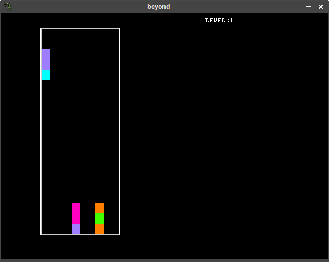
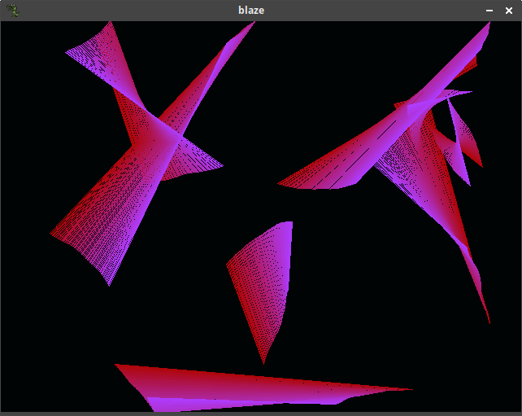
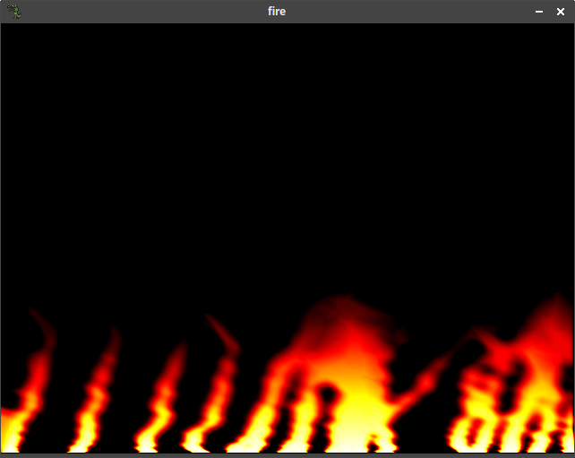
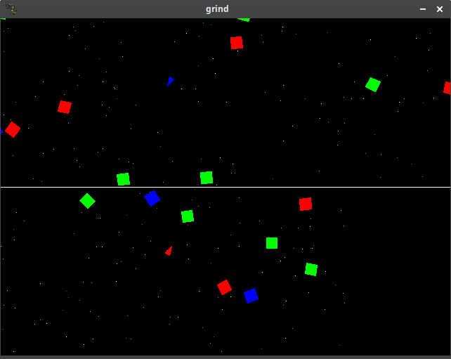
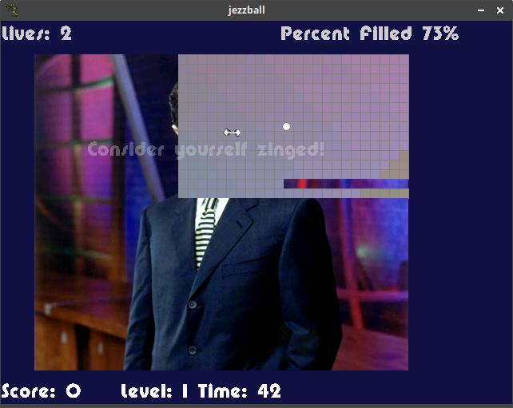
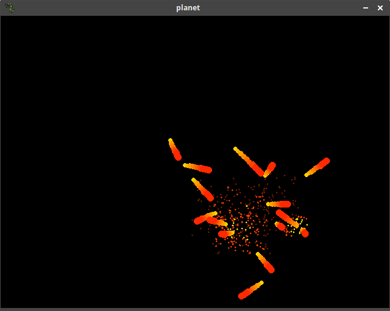
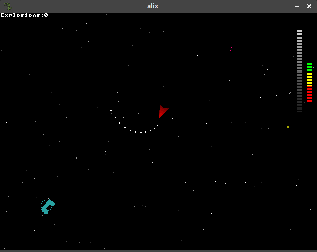

Various old hacks I wrote from the age of 13-18. Nearly everything is in C++ and uses Allegro 4.2 http://liballeg.org.

Beyond: A game somewhat similar to tetris where the colors have to match up in order for the blocks to dissappear. Based off an old game I used to play in DOS on my 386.

Blaze: A screensaver, similar to one used in microsoft windows back in the day.

Fire: Simulation of fire and smoke

Grind: A game where two players try to knock blocks into each other by ramming the blocks with a spaceship. Theres no points involved, so its more like a simulation.

Jezzball: A jezzball clone (https://www.jezzball.net/j/e/game.html). The backgrounds can be replaced by putting new jpegs into data/pics.

Planet: Simulation of multiple planetary bodies moving with gravity and smashing into each other.

Salix: A game kind of like subspace continuum where you move a spaceship around a large area shooting other enemy ships.
